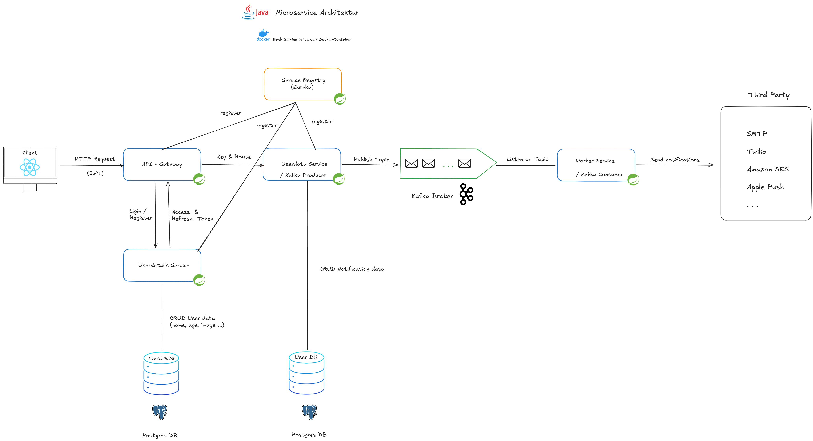
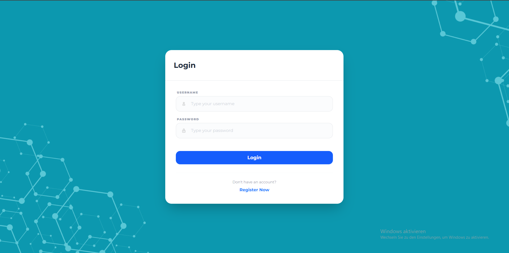
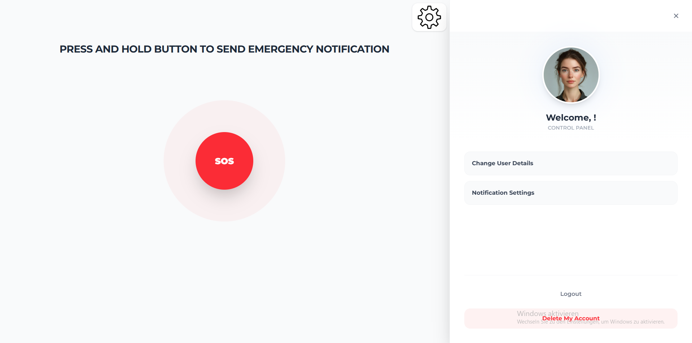
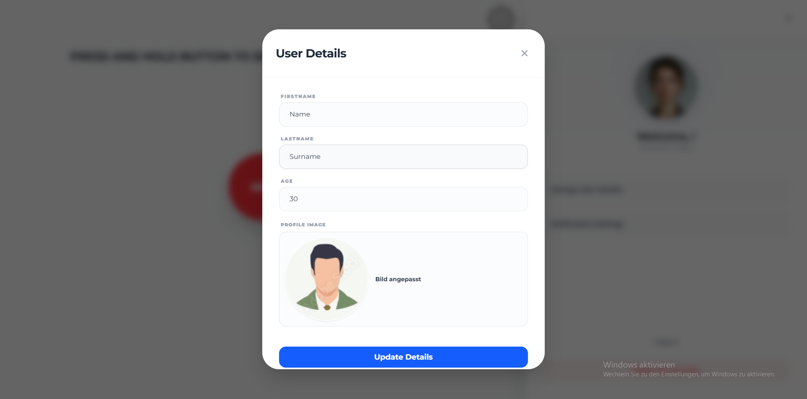
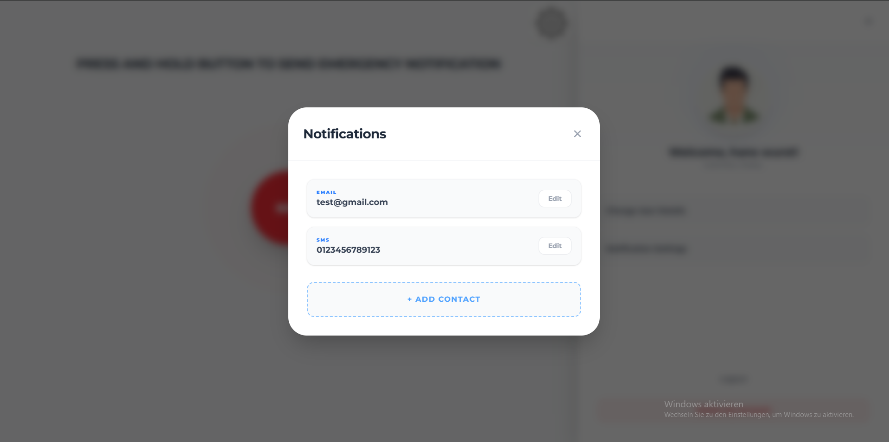

# Emergency Notification System (Microservices)


Hochverfügbares Notfall-Benachrichtigungssystem basierend auf einer Java Microservice Architektur.
Sobald ein Nutzer einen Alarm auslöst, werden hinterlegte Notfallkontakte automatisch benachrichtigt.
Die Verarbeitung erfolgt asynchron über Messaging, wodurch E-Mail- und SMS-Benachrichtigungen zuverlässig und skalierbar zugestellt werden können.

---

## System-Architektur

Um eine hohe Ausfallsicherheit zu gewährleisten, wurde die Architektur als Event-driven System umgesetzt.




### Key Architectural Patterns

- **Event-Driven Communication:** Services kommunizieren asynchron über **Apache Kafka**, wodurch eine lose Kopplung und hohe Resilienz erreicht wird.
- **Service Discovery:** Dynamische Service-Registrierung und -Auflösung über **Netflix Eureka**.
- **API Gateway:** Zentrales Routing der Requests sowie **JWT-basierte Authentifizierung**.
- **Database-per-Service:** Jeder Service besitzt eine eigene **PostgreSQL-Datenbank**, um Datenisolation und unabhängige Skalierung zu ermöglichen.

---

## Übersicht (UI)

Das Frontend basiert auf **React** und **Tailwind CSS** und wurde mit Fokus auf eine schnelle und intuitive Bedienung im Notfall entwickelt.


| Login & Registrierung | Haupt-Dashboard (SOS) |
|:---:|:---:|
|  |  |

| Nutzer-Einstellungen | Notfall-Kontakte |
|:---:|:---:|
|  |  |

---

## Technologie-Stack

### Backend (Java / Spring)
- **Spring Boot 3.x:** Basisframework für die Microservices.
- **Spring Cloud Gateway:** Zentrales Routing sowie Security-Handling.
- **Spring Security & JWT:** Authentifizierung und Autorisierung über Access- und Refresh-Tokens.
- **Spring Data JPA (Hibernate):** Persistenz-Layer für den Datenbankzugriff.

### Messaging & Infrastructure
- **Apache Kafka:** Event-Streaming und asynchrone Kommunikation zwischen den Services.
- **PostgreSQL:** Relationale Datenbank, jeweils eine Instanz pro Service (Database-per-Service Pattern).
- **Docker & Docker Compose:** Containerisierung und lokale Orchestrierung der gesamten Umgebung.

---

## Installation & Start

1. **Environment konfigurieren**

    Kopiere die Datei .env.example und benenne sie in .env um. Passe anschließend die Werte entsprechend an.


2. **Repository klonen:**
   ```bash
   git clone https://github.com/Junior264/Emergency
   cd Emergency
   docker compose up -d --build

### Roadmap & Next Steps

- **Transactional Outbox Pattern:** Implementierung zur zuverlässigen Event-Publikation nach Kafka.
- **Third-Party Integration:** Finalisierung des Twilio-Adapters sowie Unterstützung weiterer Provider.
- **Testing:** Erweiterung der Testabdeckung mit JUnit 5 und Testcontainers.
- **Monitoring:** Integration von Prometheus und Grafana für Metriken und Observability.
